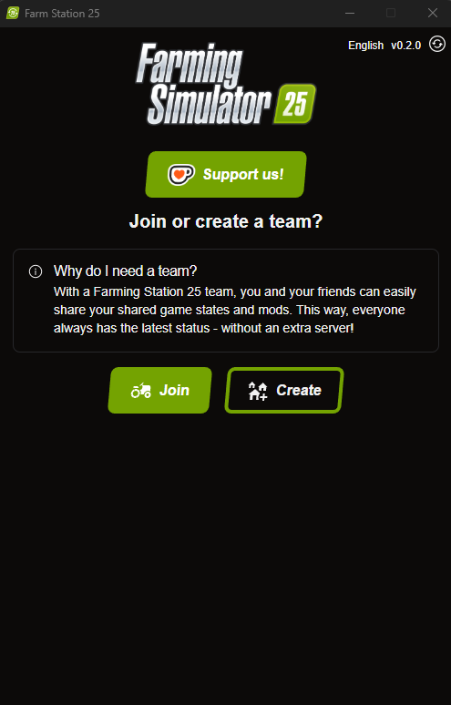
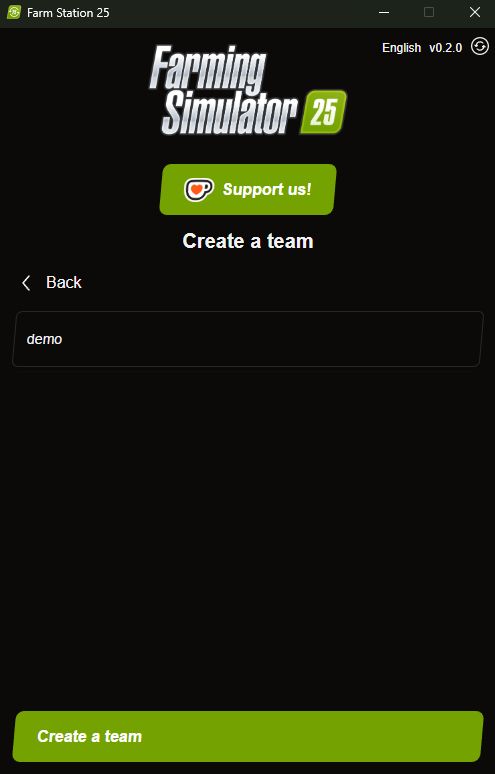
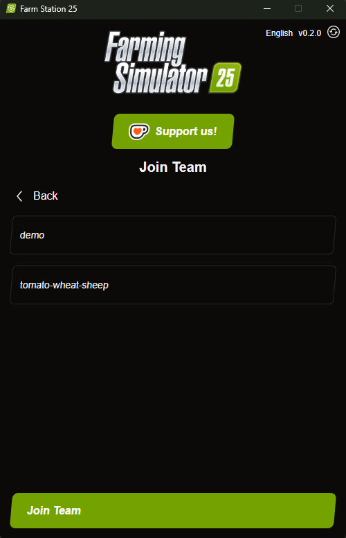
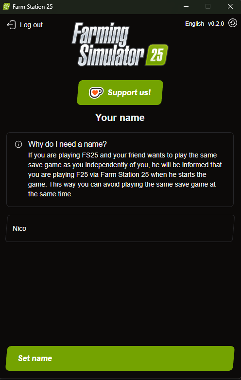
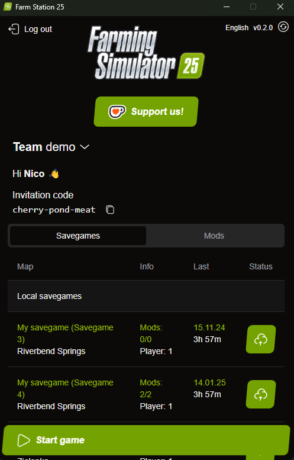
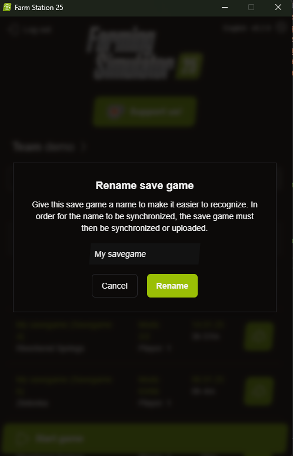

# How to Use FS25 Savegame Sync

Welcome to the FS25 Savegame Sync guide! Follow these steps to get started with the app.

## Opening the App

1. Launch the FS25 Savegame Sync application.

## Creating or Joining a Team
  
  

### Creating a New Team

1. Select "Create".
2. Enter a name for your team. (Hint: You will see an invite code to share with others in the app later on.)
  

### Joining a Team

1. Select "Join".
2. Enter the team name and invite code provided by the team creator.
  

### Choosing a Name

1. Choose a name for your profile. When you are working on your farm, and other team members want to start the game (through this app), they will see, that you are playing.
  

## Using the App

### Uploading Local Savegame or downloading Remote Savegame

1. Within the app, you will see all your local savegames as well as the savegames of your team. Choose to either upload local, download remote or sync savegames.
  

2. Pro Tip: Organize your savegames by naming them. This name is the same that is displayed in Farming Simulator. Just click on the name of any local savegame to rename it.
  

## Keeping Savegames in Sync

- **Automatic Sync**: Keep the app open. When FarmingSimulator is closed, the savegames will sync automatically.
- **Manual Sync**: Manually sync savegames through the app interface.

### Syncing Mods

- When savegames are synced, related mods are also uploaded or downloaded if they are not already on your local machine.
- Easily download mods from other users within the app.
  

## Languages

- The app is available in several languages. Choose your preferred language from the settings menu.
  

Enjoy seamless savegame and mod synchronization with Farm Station 25!
