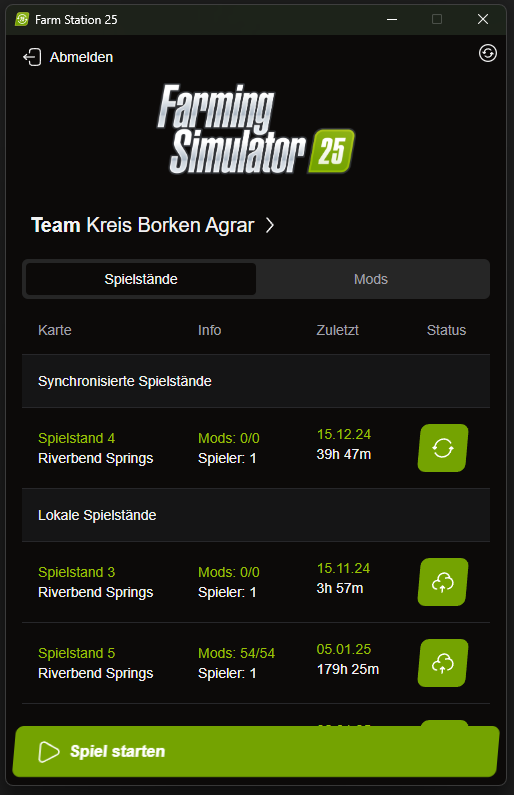
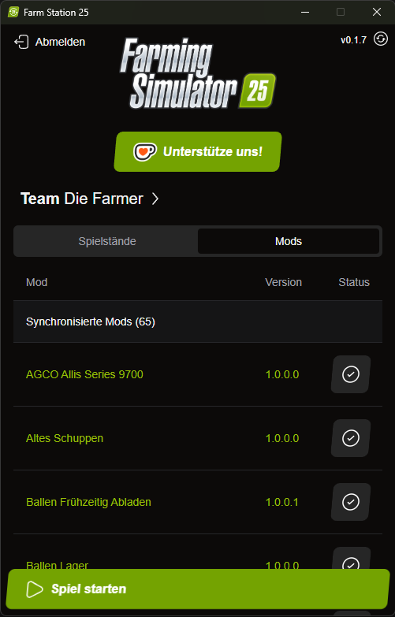

# Farming Simulator 2025 sync kit

This is a sync application that can be used as a replacement for a dedicated server when you want to play Farming Simulator 2025 with your friends.
It is a simple application that allows you to sync the game state between multiple players.

## Languages

This application is available in the following languages:
"de", "cs", "en", "es", "fr", "nl", "ru", "uk", "it", "pl"

Most of them are translated by google translate. If you find any mistakes or want to contribute to the languages,
contact me and I will invite you to contribute to the related tolgee project as a translator.
  
## Setup

To set it up, you have to follow these steps:

1. Download the latest release from the [releases page](https://github.com/eweren/FS25-farm-station-25/releases) and install it on your machine.

2. Run the application

3. Either join or create a new team 

4. Start the game and enjoy playing with your friends!

Savegames                |  Mods
:-------------------------:|:-------------------------:
 |  

## How it works

The application uses a Cloudflare worker to sync the game state between the players. The worker is a small webserver used to upload or download the savegames/mods and create or join a team. All assets are saved in a R2 bucket and the teams are saved in Cloudflare KV storage. It is not a highly secure solution, but probably the simplest way to get teams to work!

You can choose which savegames and mods you want to sync. 
When syncing a savegame, only those mods will be downloaded, that are not already present on the player's machine.
This application won't delete any mods or savegame from your machine, so nothing will be broken by using this tool!

## Contributing

If you have any suggestions or improvements, feel free to open an issue or submit a pull request!

## License

This project is licensed under the BSD 2-Clause license. See the [LICENSE](LICENSE) file for more details.

## Misc

Logs are saved under `%LocalAppData%\de.farm-station-25.app\logs`